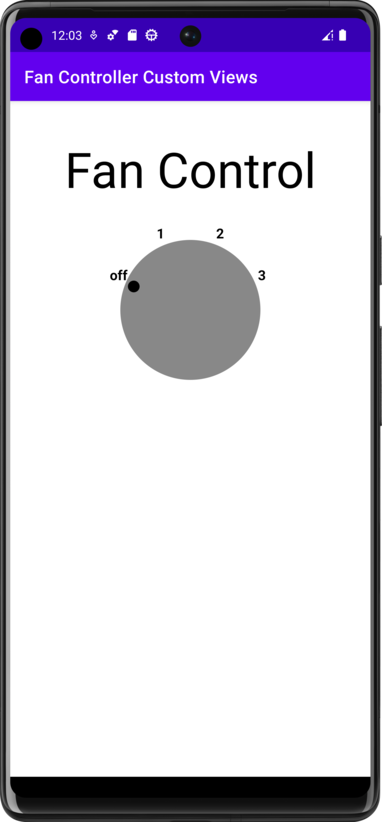

# Fan Controller Custom Views 🎚️

Project created for the Udacity nanodegree Android Kotlin Developer program.

This application going to provide the user with the ability to draw and interact with visualizations on the screen and provide custom visualizations in real time. Canvas drawing allows real-time updates to the UI based on data or interaction events. Math, pathing, and logic provide visualizations within application.

Custom Views extend the functionality of the provided base Android Views to provide additional functionality and simplify code by abstracting View-only business logic that can be self-contained within the View itself. Canvas drawing allows for the update of the display as a result of processing data or user interactions.

## Project Milestones

- Create Custom View
- Draw Fan Controller
- Add View Interactivity
- Custom Attributes

